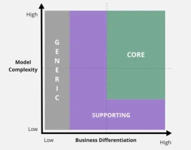

# Domain driven design

## Концепции
1. Buisiness domain - основная цель\проблема бизнеса
2. Общий язык (ubiquitous language) - общий язык: терминология, которая позволяет бизнесу и технарям общаться на одном языке, вкладывая одно и то же значение в одинаковые слова
3. Bounded context - изолированные контексты, где общий язык однозначен

### Buisiness domain

*Поддомены* - это основные проблемы, которые решает бизнес. Это можно определить, например, из частей, которые составляют компанию, и проблем, которые каждая из них решает. Для более подробной проработки надо выделить еще и задачи, которые решает каждый из этих отделов. 

Поддомены также надо сортировать по степени важности для бизнеса, возможные критерии:
1. Главное конкурентное преимущество
2. Сложность технической реализации
3. Изменчивость - если надо уметь быстро проверять гипотезы, то скорее всего понадобится большая "изолированность" от других подсистем
4. Варианты реализации с точки зрения использования готовых инструментов
5. Техническая "интересность" реализации

В любой компании обычно сущесвуют три поддомена (по Эрику Эвансу): 

| под-домен | пояснение | преиму-щество | сложность | сторонние решения | измен-чивость | интерес |
| ---- | ------ | ---- | ---- | ---- | ---- | ---- |
| core | отличие от конкурентов. Бизнесовая ценность, а не техническая (продажа товаров, а не приложение, например) | да | обычно высокая | всегда свое | частая | высокий |
| generic | одинаковые с конкурентами проблемы | - | любая | можно, или своя команда | редкая | низкий на поддержку | 
| supporting | помощь бизнесу, но без собственной ценности в отрыве от компании | - | низкая | да, аутсорс, или своя команда | редкая | низкий |

#### Core domain chart

Вместо такой таблички можно использовать Core domain chart 

Как составить:
1. Выписать все поддомены в список
2. Расположить их как кружочки на схеме в нужном квадрате, отсортировав по осям х и у
3. Раскрасить:
   1. красный - разрабатываем сразу, своими силами
   2. сервый - разрабатываем сами, но позже, 
   3. салатовый - отдаем на аутсорс
4. Провалидировать с бизнесом

---

*Чтобы отличить supporting от core:*
1. Если слабая команда с низким качеством кода может самостоятельно написать код поддомена, то это supporting
2. Если завтра этот поддомен заменят на покупной, развалится ли компания? Если да, то это core

---

Поддомены - это в первую очередь про бизнесовую ценность, а не техническую сложность. 

### Общий язык (ubiquitous language)

Доменные эксперты знают, как работает бизнес и на каком языке он говорит. Они отвечают за корректную работу бизнес-процессов в системе. Но не отвечают ( и не инетресуется тем, как это технически реализовано). *Исключение: когда домен технический, доменный эксперт должен понимать технические детали*

Доменные эксперты задают **общий язык**. Туда не входят технические детали (если домен не технический) и термины, он описывает только то, что нужно бизнесу. 

### Изолированные контексты (bounded context) 

Основная задача контекста - изолировать части системы так, чтобы внутри системы существовал однозначный общий язык. Внутри изолированного контекста решается только одна проблема (насколько крупная - вопрос).

Обычно один поддомен = один контекст, но это не абсолюная истина. Пример: notion как изолированный контекс относится к нескольким поддоменам (трекер задач, личная база знаний или совместная работа).
Обратный пример: один поддомен - магазин, второй - упаковочный отдел, а для них контекст - это продажи. 

На что обратить внимание:
1) если на один контекст приходится несколько поддоменов, то не надо ли разделить контексты?
2) если один поддомен содержит несколько контекстов, посмотреть, что будет, если не разделять эти контексты (они получились сильносвязными?)
3) один поддомен = 1 контекст - это идеал, но в реальности надо оценивать плюсы и минусы
4) обычно один контекст = 1 команда (но у команды контекстов может быть несколько)
5) биллинг - это и зачисление зарплат, и списание с клиентов денег. Далее эти процессы могут сильно разойтись. Для бизнеса эти 2 разных процесса, в одном скидки, во втором гонорары. То есть то, что биллинг технически один контекст, не будет таковым для бизнеса. Но так как надо идти от бизнеса, то это в итоге 2 отдельных процесса

## Связность данных

- Внутренняя связность*, или *cohesion* - связи внутри изолированных контекстов. 

- *Внешняя связность*, или *coupling* - это связь изолированных контекстов друг с другом.

- *Связность в порядке выполнения*, или *temporal coupling* - неявная связь по порядку выполнения. А -> B валидно, но вот B -> A  - уже нет. Например, нельзя зачислить зп до того, как первый работник будет заведен в системе, или распределить задачи до его появления. В реальной системе можно интерпретировать так: если A выйдет из строя, это зааффектит B, хотя явной связи между ними нет.
- *Функциональная связность*, или *functonal coupling* - переиспользование одной бизнес-логики в нескольких местах (например, создание пользователя)
- *Implementation coupling* - как предыдущая, только на уровне бизнес-логики нет общей части, а на уровне кода она появляется. Например, все сервисы, которые получают данные об Х из ряда таблиц, будут собирать эту инфу по всем таблицам.
- Static coupling - например, fk в базе данных. Или связи на уровне библиотек.

и тд.))
 
Идеал: высокий cohesion и низкий coupling. 

