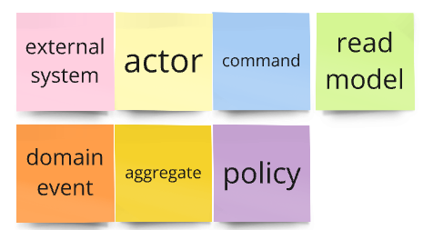
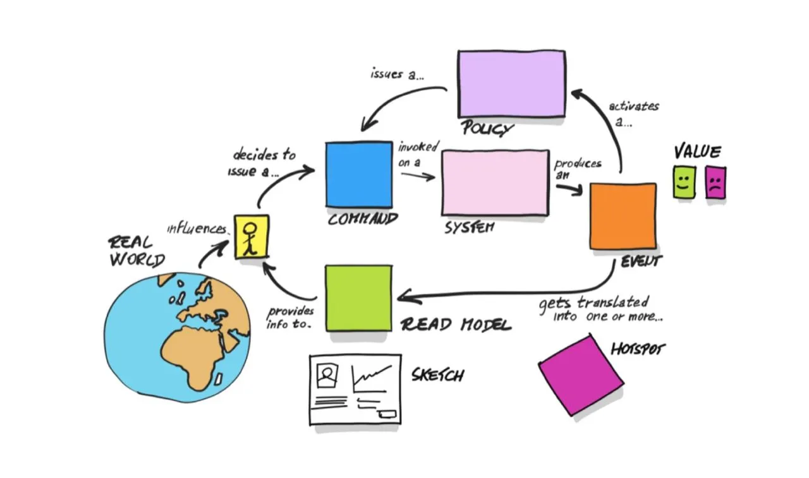

# Event storming
Это бизнесовые события и процессы, а не технические детали. "Что произошло" без оглядки на то, "как 

## Шаблон

- Actor - желтый - тот, кто запускает команду (человек/система)
- Command - голубой - действие, совершаемое системой, "что произойдет?", но не имеет отношения к тому, "как?"
- Domain event - оранжевый - бизнес-событие, в прощедшем времени описывает, что произошло. Может вызывать другую команду. Событие необратимо. 
- Policy - фиолетовый - правило, при котором вызывается команда, условие. Не путать с тем, что можно считать частью бизнес логики. "если заказ оформлен, то отправить пуш" - это не policy + command, а просто command. Это не техническое описание, а бизнесовое правило.Проще всего понять так: policy есть всегда, где событие вызывает команду (актора нет). В основном этот стикер содержит слово "всегда", поэтому опускается. Если между событием и командой слово "всегда" не подходит, тогда надо добавлять Policy.
- External system - розовый - другие системы, с которыми нам приходится взаимодействовать. Он всегда ДО команды (и вроде когда актора нет), чтобы обработать поступившее событие только при определенных условиях. После команды всегда детали алгоритма. И еще стоит смотреть, то, что хочется выделить как полиси, не будет ли частью рид модели. Полиси ставим только там, где система **сама** регаирует на событие, т.е нет актора
- без конкретики, не нужно говорить, какой. Крон и аналоги - это внешнаяя система.
- Read model - зеленый - та инфа о системе, которую надо получить актору для выполнения команды. Это данные, без которых нельзя принять решение о выполнении действия. По сути есть всегда, когда есть актор (и ее нет всегда, когда актора нет). Она помогает именно актору принять решение, являясь для него контекстом.
- 

## Порядок действий
1) Собираем все события, которые происходят в системе
2) Связываем их стрелками, показывая, кто кого вызывает. Располагаем стикеры с учетом того, условно есть временная линия, и события справа происходят позже левых. При этом события, которые просто последовательно происходят, не надо соединять стрелками, достаточно соблюдать правило расположения более поздних правее. 
3) К каждому из них дописываем, кто и какое действие выполняет (актор и команда) + условия выполнения команд (правила). Внешняя система всегда вызывается командой и возвращает событие. Событие по расписанию описываем тоже через внешнюю систему.
4) Выделяем контексты - группы связанных событий, являющихся частью одного процесса
5) Если данные, необходимые актору - это сложная составная модель, ее лучше отразить в read model. А вот очевидные read model не пригодятся.

## Заметки
Если цепочка состоит из 3+ событий, это повод задуматься, нет ли в ней технических деталей.

Комментарии супер. Их можно оставлять себе на будущее, а можно дополнять ими контекст.
