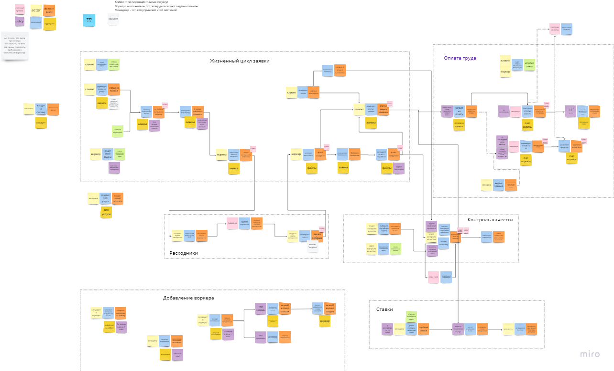
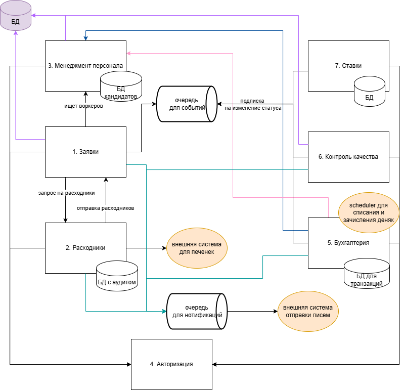

# [**EVENT STORMING**](https://miro.com/welcomeonboard/Tmh2VEd2eUI5UktXUzBVTE8wbG5rOHVUMFgxWWVtdnMzT1c0bzVrMTZnNkhjRTdZQTJlazRLVm5OUHpOT1RBc3c0aFMrS01ja0lkUjdyNzUwZjVyU3FiZUNZYmlNSlJacGVKWkRCUGZLSzZGa1FnU2k1ekpYbVl4NjhSS3hPVXkhZQ==?share_link_id=24647857868) 

Так как ранее проходила курс по асинхронной акрхитектуре и после него пару раз использовала ES в работе, поэтому начала с ES. Доступен в миро (ссылка = заголовок), "масштаб бедствия" представлен на рисунке, но из-за количества элементов он все равно не читаем))

# ДИАГРАММА

### Описание 
Вся система - это монолит, чтобы не запариваться с синхронизаций данных. Внутри монолита используются события для оповещения об изменении статуса задачи, также все нотификации кладутся в очередь и асинхронно отправляются на почту заинтересованным лицам.

1. Заявки:
   1. получение заявок по роли
   2. создание заявок (весь флоу от заполнения данных до назначения воркера и цены)
   3. изменение статуса (с проверкой прав) с публикацией статуса об изменении
   4. апи для изменения флага передачи расходников по задачи (чтоб не городить события на выделение ресурсов и не делать синхронное ожидание ответа от сервиса расходников)
   5. ui:
      - для воркера - его задачи во всех статусах, запрос ресурсов по задаче, запрос на изменение статуса заявки 
      - для клиента - созданные им задачи во всех статусах + кнопка создания новой задачи + форма для заполнения задачи + изменение статуса по задаче

2. Расходники:
   1. апи запроса расходников, которым пользуется сервис заявок
   2. апи для передачи расходников, под капотом дергает апи изменения передачи расходников сервису заявок (1.4)
   3. подсистема для взаимодействия с внешней системой по предоставлению печенек с предсказаниями
   4. своя бд для аудита выданных артефактов - на будущее точно пригодится 
   
3. Менеджмент персонала:
   1. апи для управления тестированиями
   2. апи для управления базой тестов
   3. апи для зачисления воркера на работу
   4. своя бд под то, чтобы хранить данные о кандидатах, заявки от них (можно удалять отклоненные, можно хранить - вдруг порог входа понизится и придется набрать больше кошечковых)
   5. уже зачисленных на работу воркеров храним в бд монолита и не паримся об оповещениях и синхронизации кадровых изменений
   
4. Авторизация. Пользуется бд монолита, ничего отдельно вытаскивать без необходимости не будем
5. Бухгалтерия
   1. ui: дашборд изменений счета авторизованного юзера
   2. своя бд для транзакций, храним отдельно от бд монолита
   3. инфу о воркерах, ценах задач и прочем берем из бд монолита
   4. планировщик задач по расписанию: последний день месяца на зачисление зп воркерам, каждое воскресенье - списание со счета клиентов 
   5. выдача премий для воркера (проверка прав - только менеджер)
   6. по событию изменения статуса задачи обновляется сумма к зачислению и списанию (с записью в лог событий)
   
6. Контроль качества
   1. апи для проверки рандомной задачи
   2. по событию отмены задачи - проверка задачи
   3. ui получения инфы о флоу обработки задачи и инфе о заказчике - берем из бд монолита
   4. рекомендательная подсистема по формированию предложений бизнесу на основе аналитики 
7. Ставки
   1. главный претендент на вынос из монолита, так как система работает "в черную"
   2. своя бд - класть в бд монолита нельзя, мы скрываемся 
   3.  апи для получения результата по ставке  - не инициирует никаких финансовых движений, только рассчитывает, кто кому сколько должен и выдает это в ридонли формате
   4. апишка для создания ставки
   