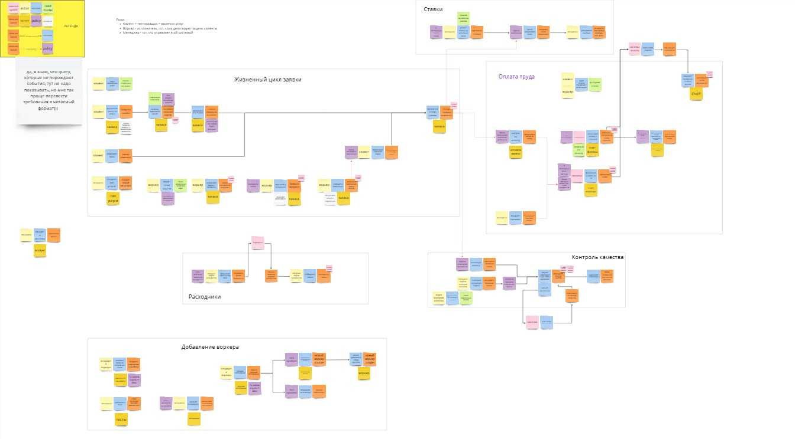
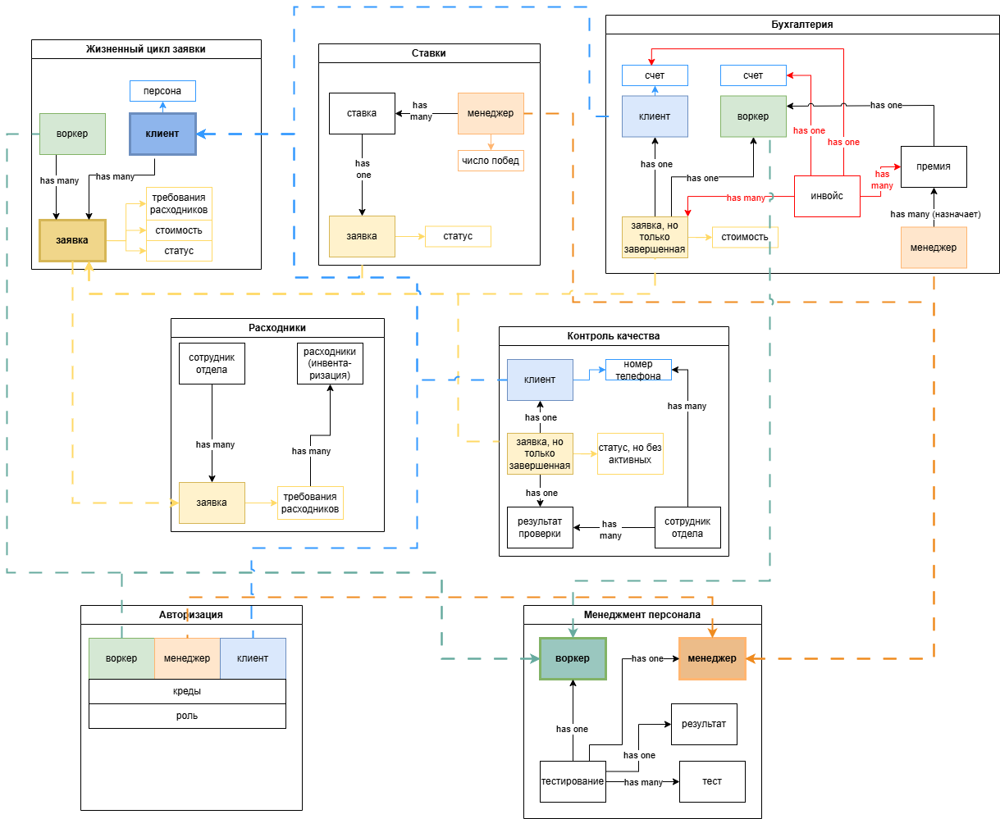
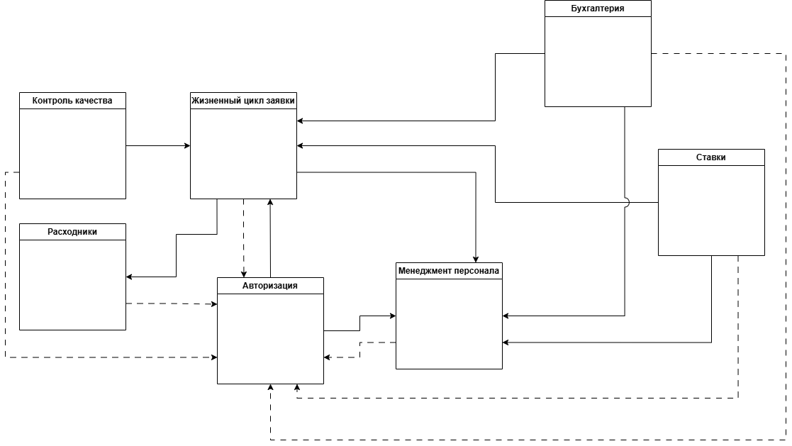
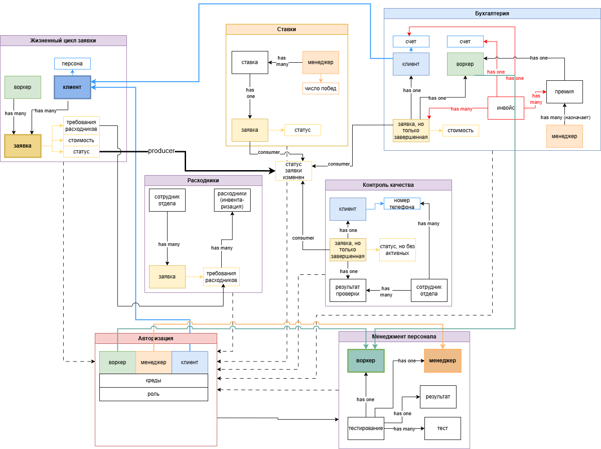
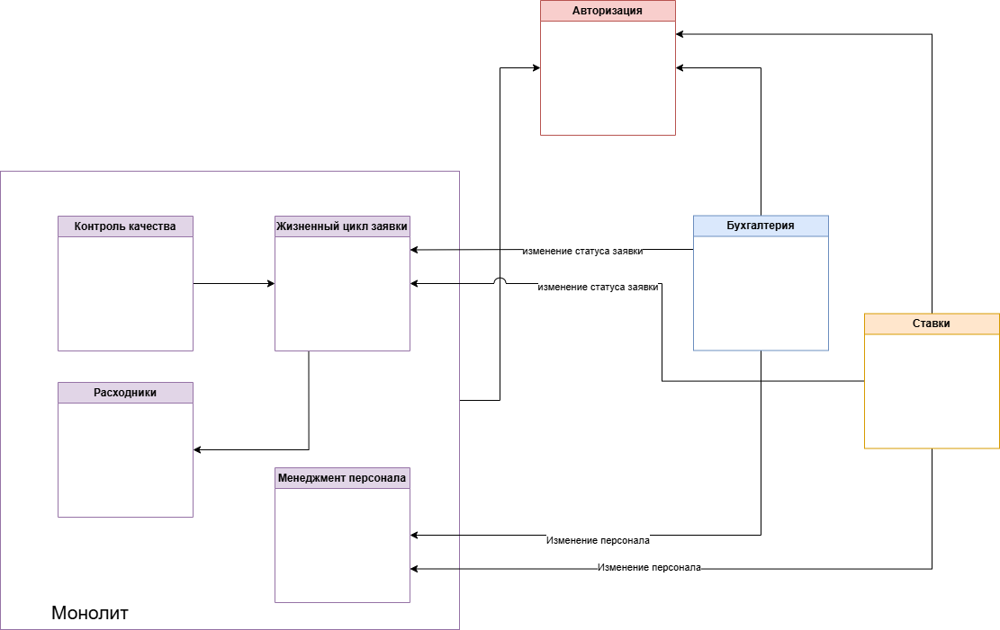
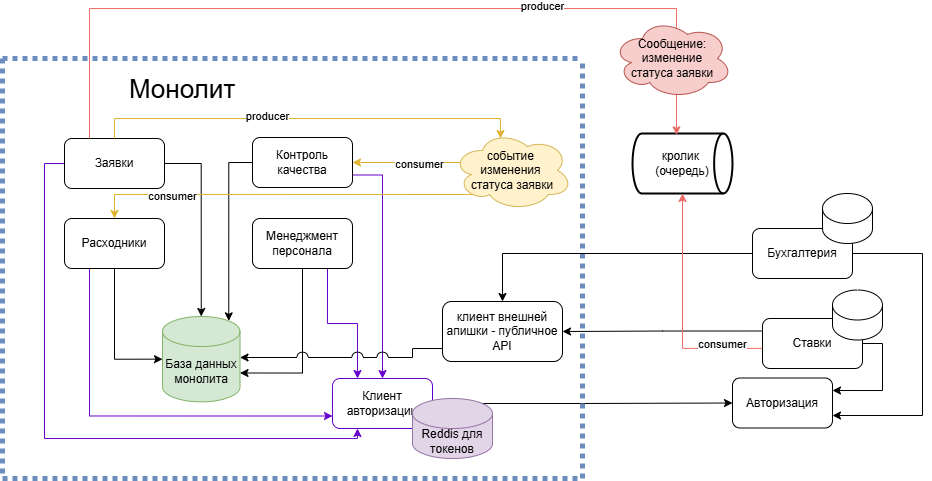

## [Event storming](https://miro.com/app/board/uXjVNtDepfs=/?moveToWidget=3458764613911662227&cot=14)
Картинка-спойлер, так как качество экспорта не позволяет сделать ее читаемой. **Название кликабельно, там ссылочка на миро**

Выделено:
- жизненный цикл заявки 
- работа с персоналом
- снабжение расходниками - подсистема, в которой может потребоваться специфичная отчетность и другие особенности, не касающиеся основной цели компании
- авторизация 
- ставки - это теневая бухгалтерия, этому сервису достаточно знать о менеджерах и активных задачах, а так же получать инфу о завершении задачи, у него узко направленная специализация
- оплата труда = бухгалтерия - скрывает детали того, как, когда и кому сколько выплачивается, так же может подлежать особой отчетности 
- контроль качества = сбор статистической информации и формирование гипотез

## Модель данных для требуемой системы

Файл лежит в этой директории, если нужно покрупнее.

Основные моменты:
1. Связи с сервисом авторизации не показала, чтобы не загромождать рисунок
2. Пока не появится требования на поддержку аккаунтов сотрудников-заказчиков, отдельная подсистема под персон не будет добавлена
3. Обновление данных:
   1.  Мгновенная реакция нужна для сервиса авторизации. При входе в систему (SSO) будет отправляться асинхронный запрос по апи, пользователь будет в ожидании ответа
   2.  Сервис расходников должен подписаться на события и обрабатывать их с минимальной задержкой, взаимодейтсвие асинхронное
   3.  Сервис заявок и сервис авторизации должны с минимальной задержкой реагировать на событие добавления нового воркера в систему
   4.  Для остальных сервисов можно делать синхронизацию по расписанию, так как нет необходимости в мгновенной реакции (зачем усложнять, если можно не усложнять)

### Доработка
UPD: Упс, я сделала это до урока 1.2, оставляю без изменений первую версию:
Чтобы уменьшить time-to-market и не делать сложных механизмов синхронизации, можно сделать часть кода монолитным, привязав сервисы к общей БД. При этом можно оставить отдельно авторизацию, бухгалтерию и сервис ставок - они будут подписаны на события, публикуемые монолитом, и будут иметь свои бд

## Архитектура и взаимодействие сервисов

Система состоит из нескольких частей:
   ### "Монолит"
В него попали:
   - заявки,
   - расходники,
   - контроль качества,
   - менеджмент, 
   - клиент для авторизации и хранилище auth токенов (**правда, мб оно и не нужно, можно их писать в базу и хранить в куках фронта**) 
   - внешняя апишка (дает получить сотрудников и заявки по статусу )
Все сервисы подключены к общей базе данных. Это позволяет не тратить ресурсы на синхронизацию данных, пока система небольшая, это ускоряет разработку. Не получить свалку помогает условное деление на сервисы внутри монолита - пусть у них одна база, но на уровне интерфейсов через модификаторы доступа можно ограничить их взаимодействие.

### Бухгалтерия
Для бухгалтерии не важно, что происходит в системе в режиме реального времени. В определенные дни будут выполняться джобы "посчитать зп воркера", "посчитать, сколько списать с клиента". Тем, у кого есть доступ к бухгалтерии (менеджерам) можно войти в приложение и в ее собственной бд внести информацию о премиях.

Если бизнес захочет в системе бухгалтерии видеть завершенные задачи сразу, а не получать их при выполнении джобы, можно будет подписаться на очередь сообщений о смене статуса заявки. 

Бухгалтерия вынесена, потому что ее фичевая доработка обычно идет независимо от продуктовой разработки основной системы. Доработку системы бухгалтерии при необходимости можно отдать на аутсорс.

### Ставки
Предполагая желание котоменджеров в азарте получать выигрыш сразу, подписываемся на очередь сообщений об изменении статуса задач.
Для получения списка менеджеров используется внешнее апи монолита.

Так как финансовыми переводами сервис заниматься не должен (менеджеры сами переводят деньги), задача сервиса только в расчетах рекомендуемых движений средств.

Сервис может развиваться независимым путем, привлекать новых сторонних игроков в дальнейшем и так далее. На текущий момент теневая экономика отделяется от монолита для того, чтобы не смешивать официальный заработок и продуктовую ценность компании со внутренними процессами

### Авторизация
Так как для продукта понадобилось несколько сервисов, используем SSO.

# На подумать:
1. Менеджмент персонала в дальнейшем станет первым претендентом на отделение от монолита, так как система для hr развивается независимо от продуктовой разработки. На текущий момент он помещен в монолит, чтобы не заниматься синхронизацией данных о работниках продукта при том, что о них нужна актуальная информация
2. Расходники, возможно, стоит обеспечить собстенной базой, потому что они будут по мере развития системы обрастать аудитом, поддерживать инвентеризацию и так далее - но эти проблемы можно решать по мере поступления
3. По сути представленная схема - смесь (не очень то и микро) сервисов, что с одной стороны заставляет заниматься синхронизацией данных или их получением по сетке, с другой не дает полностью независимо разрабатывать ее части. На начальном этапе разработки системы принимаю это за компромиссный вариант 
