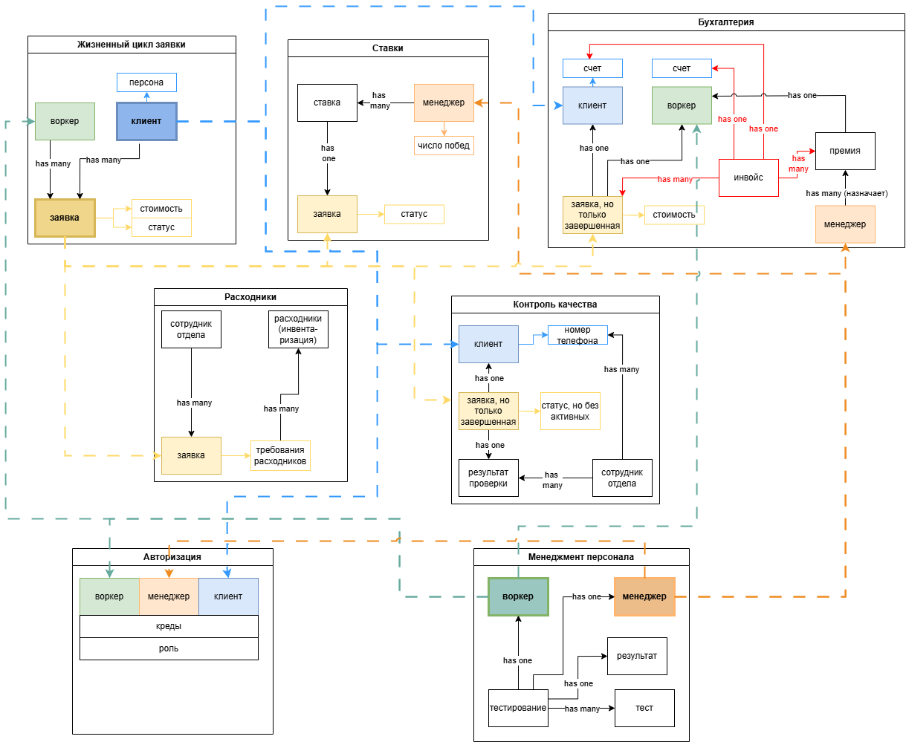

## [Event storming](https://miro.com/app/board/uXjVNtDepfs=/?moveToWidget=3458764613911662227&cot=14)
Картинка-спойлер, так как качество экспорта не позволяет сделать ее читаемой

Выделено:
- жизненный цикл заявки 
- работа с персоналом
- снабжение расходниками - подсистема, в которой может потребоваться специфичная отчетность и другие особенности, не касающиеся основной цели компании
- авторизация 
- ставки - это теневая бухгалтерия, этому сервису достаточно знать о менеджерах и активных задачах, а так же получать инфу о завершении задачи, у него узко направленная специализация
- оплата труда = бухгалтерия - скрывает детали того, как, когда и кому сколько выплачивается, так же может подлежать особой отчетности 
- контроль качества = сбор статистической информации и формирование гипотез

## Модель данных для требуемой системы

Файл лежит в этой директории, если нужно покрупнее.
Основные моменты:
1. Пока не появится требования на поддержку аккаунтов сотрудников-заказчиков, отдельная подсистема под персон не будет добавлена
2. Обновление данных:
   1.  Мгновенная реакция нужна для сервиса авторизации. При входе в систему (SSO) будет отправляться асинхронный запрос по апи, пользователь будет в ожидании ответа
   2.  Сервис расходников должен подписаться на события и обрабатывать их с минимальной задержкой, взаимодейтсвие асинхронное
   3.  Сервис заявок и сервис авторизации должны с минимальной задержкой реагировать на событие добавления нового воркера в систему
   4.  Для остальных сервисов можно делать синхронизацию по расписанию, так как нет необходимости в мгновенной реакции (зачем усложнять, если можно не усложнять)
