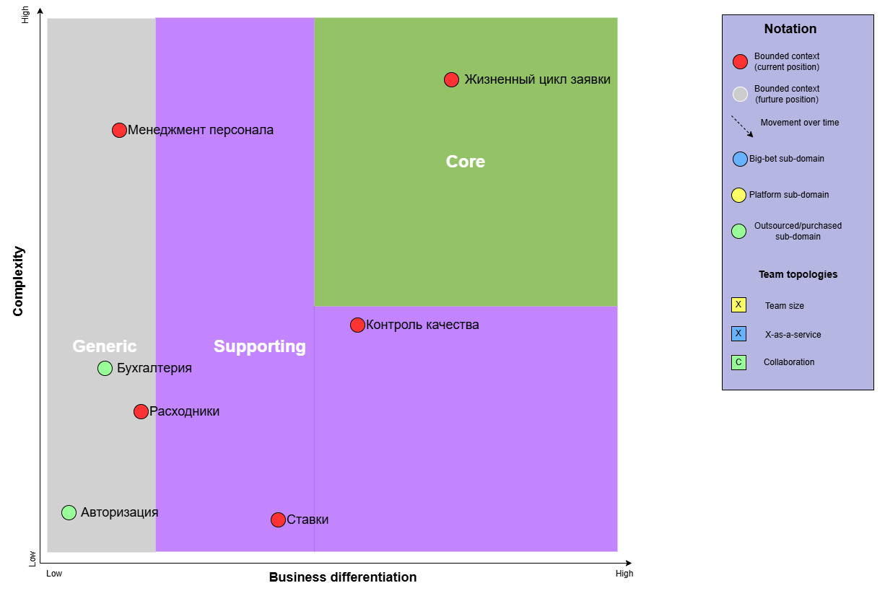
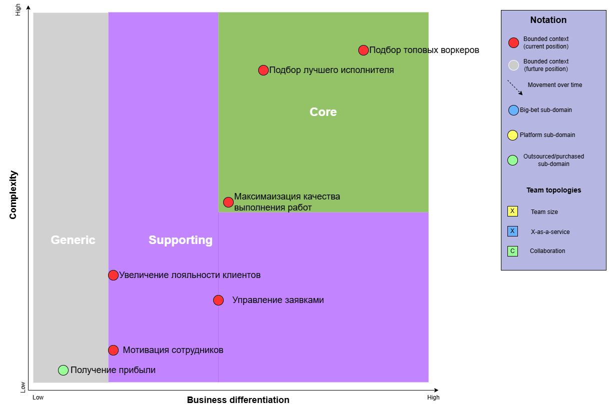
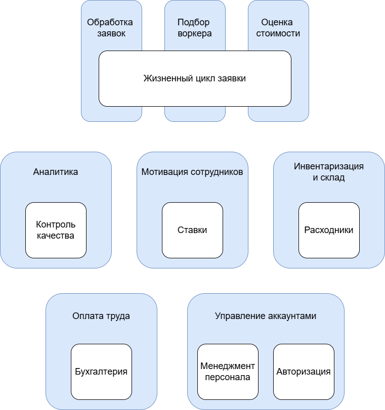
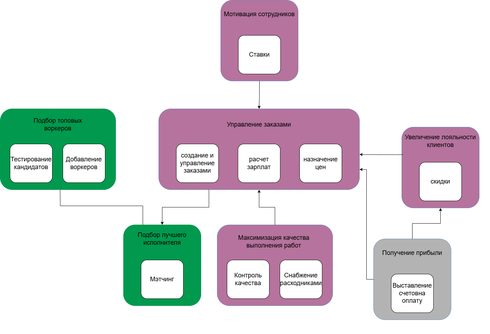
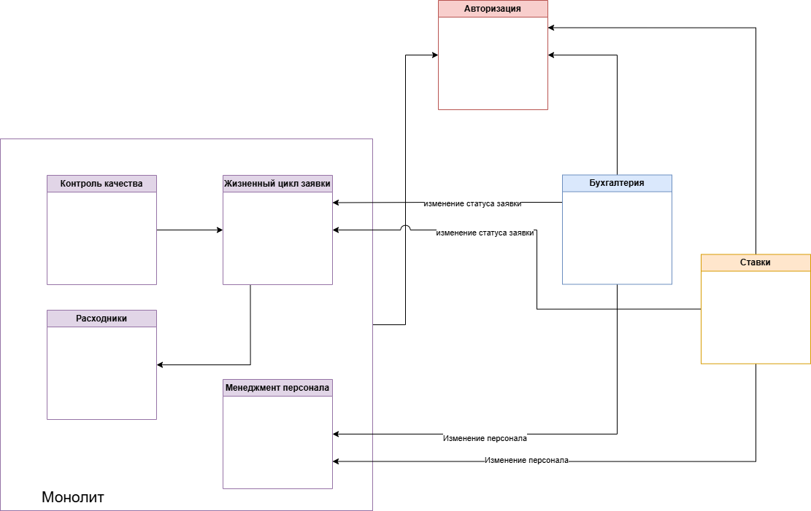
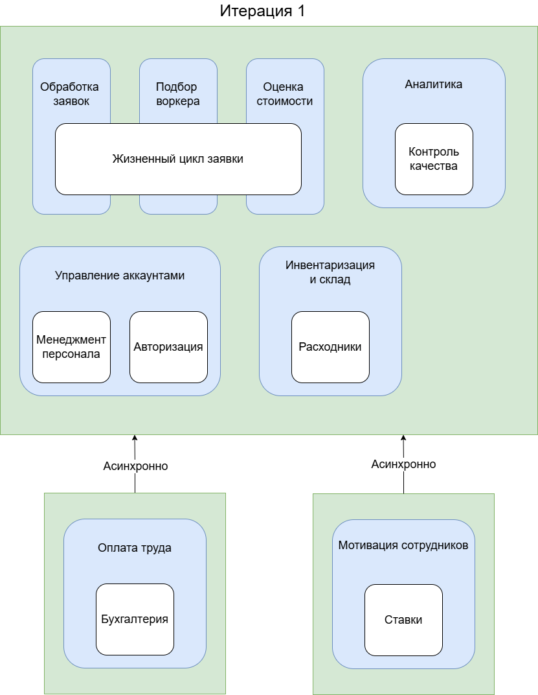
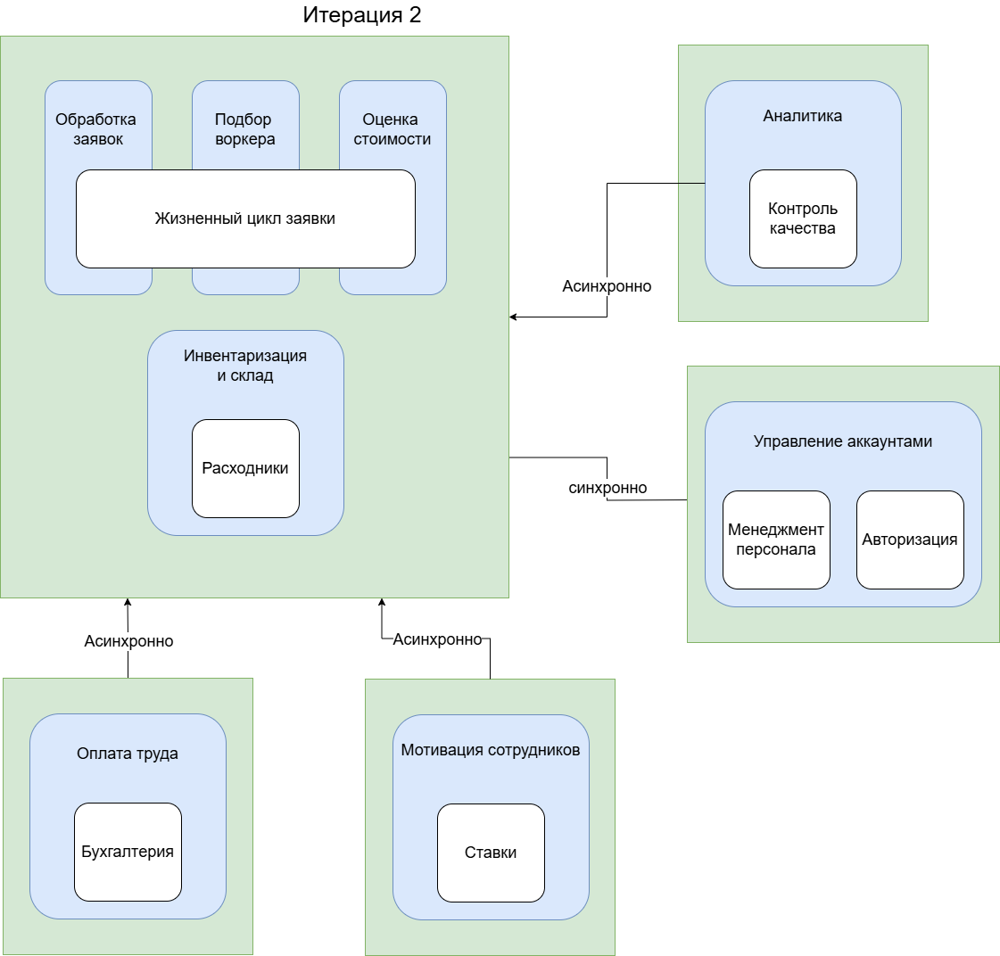
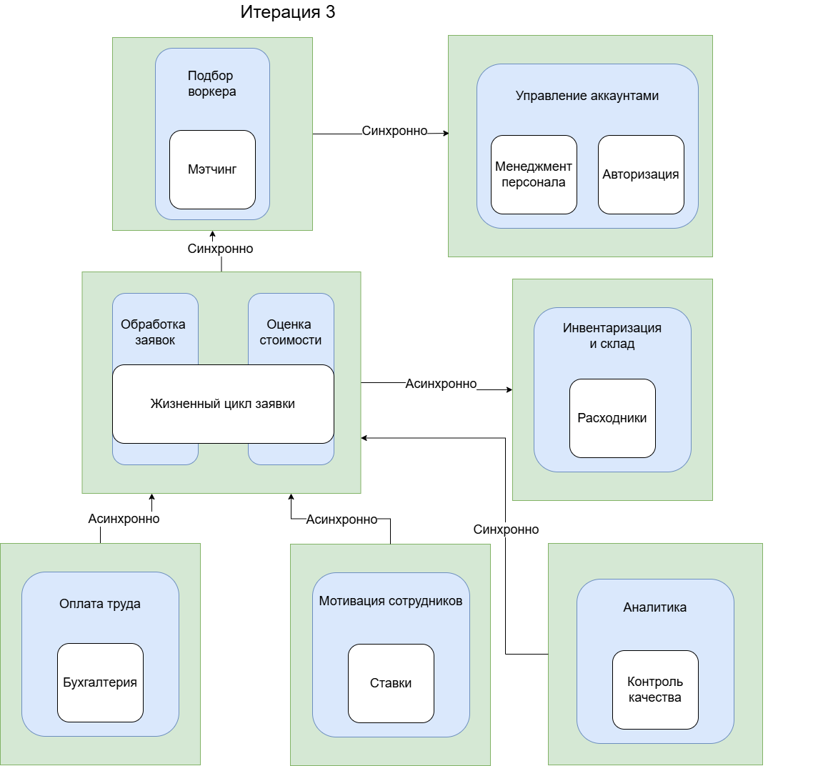

# Задание
1. Список всех поддоменов в системе с логикой их выбора
2. Core domain chart + таблица из урока
3. Bounded-контексты
4. Сравнение с ES и описание расхождений
5. Описание важных характеристик проекта
6. Архитектурный стиль
7. Итоговая модель системы

# Алгоритм действий

- Главная проблема - это домен. Это цель, "что мы хотим сделать"
- Главную проблему бьем на проблемы поменьше. Проблемы поменьше - это поддомены. "как мы хотим это сделать" (увеличение мотивации - это проблема) Реализация не может быть поддоменом.
- К проблемам поменьше ищем решения. Решения  - это bounded контексты. "что конкретно мы хотим сделать?". Сумма всех этих решений должна решать главную проблему. (ставки - bounded context)

Бизнесовые отделы могут решать несколько проблем. То есть от отдела понимаем, какие проблемы он решает, а потом уже выделяем предоставляемые решения. Сам отдел не может быть проблемой.

**Главная проблема системы** - уменьшение "неважной" рутины для котов-тестировщиков, которая мешает им работать

Доменная модель = функция (как оно работает, то есть ES) + модель данных (ее структура, из чего она состоит) .

Чем больше кор доменов, тем круче бизнес (и тем увереннее он держится на плаву) Поэтому по мере развития надо дотащить как можно больше доменов до кора.

# Поддомены

1. Управление зявкой - это весь процесс от создания заявки клиентом до получения им результата. Основная цель компании, но не конкурентное преимущество (ведь есть тот же профи ру)
1. Мэтчинг пользователей - это основная ценность компании, то, для чего вообще создается система.
1. Менеджмент персонала - вспомогательная система, это процесс найма новых кадров. Ее главная задача - управлять пулом работников. Потенциально интересен тем, что может развиться в уникальную систему с базой знаний, тестированиями. Также процесс выделения характеристик и критерии оценки работников могут быть интересны и сложны (с точки зрения составляения алгоритма) UPD: уже основная ценность компании
1. Контроль качества - вспомогательная система, которая предоставляет бизнесу информацию о процессе работы воркеров и способах повышения ее качества.
1. Авторизация - вспомогательный сервис для саморегистраци и получения доступа к своим заявкам (созданным или поступвшим на обработку в зависимости от роли).
1. Бухгалтерия - вспомогательная система для финансовых операций и расчета заработной платы.
1. Ставки - вспомогательная система для повышения мотивации сотрудников
Расходники - спорно, стоит ли ее выделять, но из тех же соображений, что в дз1, решила, что эта подсистема может обособленно от остального развиваться

## Вторая версия (после разбора)
Инвойс для работника - это зачисление, для клиента - это списание. Значит, они не могут лечь в один контекст.
Связи уровня имплементации (типа дашборда) здесь учитывать не надо

1. **Управление заказами**

   Проблема: пользователи делают заказы и получают результат

   Решение: 
   - жизненный цикл заявки
   - управление воркерами
   - управление зарплатами
   (заказ считается выполненным, когда проходит оплата)

   Generic domain (никак не core). Сложность любая может быть

1. **Подбор лучшего исполнителя** 

   Проблема: как идеально подобрать исполнителя под задачу?

   Решение: 
      - тот самый топовый мэтчинг в разработке
   Сначала низкий. Потом высокий - это core.
   

1. **Максимаизация качества выполнения работ** 

   Проблема: как качественно выполнять заявки?

   Решение: 
      - контроль качества
      - снабжение расходниками

3. **Подбор топовых воркеров** 

   Проблема: нужны исполнители-воркеры, которые будут выполнять заявки
   Решение: 
      - тестирования, которые выявляют самых крутых котиков

      Описание: сам набор - вспомогательная система, это процесс найма новых кадров. Ее главная задача - управлять пулом работников. В первой итерации набор рандомный. Во второй итерации потенциально интересен тем, что может развиться в уникальную систему с базой знаний, тестированиями. Также процесс выделения характеристик и критерии оценки работников могут быть интересны и сложны (с точки зрения составляения алгоритма)
      Это core.

4. **Увеличение лояльности клиентов** 

   Проблема: удовлетворенность клиентов

   Решение: 
   - скидки (система лояльности)

   Описание: вспомогательная система, которая предоставляет бизнесу информацию о процессе работы воркеров и способах повышения ее качества. 

6. **Получение прибыли** 

   Проблема: мы хотим на этом заработать

   Решение:
      - назначение цены на услуги (сейчас простой, далее - сложная формула)
      - выставление счетов клиентам

7. **Мотивация сотрудников** 

   Проблема: для качественного выполнения работы сотрудникам нужна мотивация

   Решение: система ставок

# Core domain chart

Первая версия

После просмотра разбора

| поддомен | преиму-щество | сложность | сторонние решения | измен-чивость | интерес |
| ---- | ---- | ---- | ---- | ---- | ---- |
| Управление заказами | нет | средняя | может быть, но сложно найти подходящее | высокая | высокий |
| Подбор лучшего исполнителя | да | высокая | нет | максимальная | высокий |
| Максимаизация качества выполнения работ | где-то на грани | средняя | может быть | средняя | низкий |
| Подбор топовых воркеров | может быть | средняя | нет | высокая | средний |
| Увеличение лояльности клиентов | нет | низкая | может быть| редняя | низкий |
| Получение прибыли | нет | низкая, все решают эту задачу | да, типовое решение | низкая | низкий |
| Мотивация сотрудников | скорее нет | низкая, алгоритм простой | может быть, надо искать | низкая | средний, как идея может быть интересно |

Сравнение до разбора и после:
- Основное отличие результата от 1 версии: я на основе требований не выделяла матчинг как что-то крутое, потому что это только план. В реальности мы имеем функцию рандома. Но на схеме все же отнесла как главное преимущество с верой в то, что бизнес действительно скоро придет с крутой системой (которую я все равно буду выделять не раньше, чем когда бизнес даст что-то сложнее рандома)
- жизненный цикл заявки мне казался самым важным в системе, но сейчас я поняла, что в самом процессе управления ей нет ценности. Ценны элементы, которые выделяются из цепочки - матчинг, качество
  

Малыши смотрят на мое решение с недоверием

# Bounded-контексты
Это только начало, да?

| поддомен | вид | контекст | 
| ---- | ---- | ---- | 
| Управление заказами | supporting | планирование заявок + управление зарплатами + назначение цен |
| Подбор лучшего исполнителя | core | мэтчинг | 
| Максимаизация качества выполнения работ | supporting | контроль качества + снабжение расходниками |
| Подбор топовых воркеров | core | тестирование кандидатов + создание воркеров | 
| Увеличение лояльности клиентов | supporting\generic | система лояльности |
| Получение прибыли | generic | выставление счетов на оплату |
| Мотивация сотрудников  | supporting | ставки | 

Версия до разбора

Версия после разбора. Цветные квадраты - это поддомены, а белые - это контексты. В прошлый раз было перепутано.

# ДАЛЬШЕ Я НИЧЕО НЕ ОБНОВЛЯЛА ПОСЛЕ РАЗБОРА

**[OUTDATED] не актуально после разбора**

Три контекста на заявки - сейчас уже известно, что подбор воркера и оценка стоимости будут черными ящиками, которые будут развиваться отдельно (и их смогут независимо развивать разные команды). Сейчас они еще совсем маленькие, ограничиваются одной формулой, поэтому отделять их нет смысла. Но хочется иметь на схеме, чтобы при доработке системы в будущем не забыть о планах на их развитие.

Управление аккаунтами - тут я просто не знаю, надо или не надо это объединять. Если мы купим готовое решение для аутентификации, сами накинем сверху собственную ролевую модельку, ролями при этом будут управлять менеджеры, то вроде выглядит норм. Но есть сомнения.. 

*Ломая четвертую стену*: **Ребята, которые будут проверять, напишите свое мнение в комменты, пожалуйста))**

# Описание важных характеристик проекта 
- каждый, кто зарегистрируется в системе (самостоятельно, то есть через сервис авторизации может быть создан новый юзер), может оставить заявку. При этом ему доступна возможность присоединиться к команде воркеров, отправив соотвестующий запрос и пройдя тестирование.

# Сравнение с ES и описание расхождений
1) Авторизация и управление персоналом, так и не понимаю, одно это или разное..
2) Расходники я и тут, и в [Event storming](https://miro.com/app/board/uXjVNtDepfs=/?moveToWidget=3458764613911662227&cot=14) закинула отдельно от заявок, но вот думаю, не оверинжиниринг ли это на старте системы. Хотя тут тоже можно купить какую-нибудь стороннюю систему инвентаризации.
В остальном вроде все то же самое.

# Архитектурный стиль
Важно для системы: 
- из-за time to market:
  -  agilability (гибкость), 
  -  testability (простота и полнота тестируемости)
  -  deployability (простота и отлаженность деплоя)
-  из-за стадии системы, она находится в точке роста: 
   -  scalability (рост средней нагрузки)
   -  elasticity (рост пиковой нагрузки)
   -  modifiability (уже сейчас закладываются новые фичи вроде оценки стоимости работ и подбора воркера)
-  из-за ожидания ddos
   -  securability (защищенность)
-  из-за того, что бизнесу важно оценивать процесс и повышать качество за счет обратной связи от клиентов 
   -  usability
- из-за того, что мы вообще-то только начинаем автоматизировать, и нам надо сделать кучу всего
  - simplicity

Если "в лоб" посчитать количество звездочек на таблице из урока, то:

| архитектура | * |
| --- |--- |
| модульный монолит | 18 | 
| service based | 25 | 
| микросервисы | 34 |  

Но если бы все было так просто, все бы использзовали только микросервисы :) Субъективно хочется добавить веса метрикам, где у простоты будет высокий вес - нам надо с нуля спроектировать и написать систему, и на начальном этапе всегда приходится жертвовать качеством для того, чтобы выиграть время (и обеспечить себя техдолгом на пару лет, конечно)

От предложеного в первом дз варианта пока не хочется отказываться (приведено без изменений)

Здесь предложен гибридный вариант. Те части системы, которые будут часто взаимодействовать, хочется объединить в модульный монолит. Код будет распределен по проектам, определенным bounded контекстами и бизнесом. В случае увеличения нагрузки - добавляем инстанс монолита.
Разделение по модулям поможет нам по мере роста системы вытаскивать домены из монолита (например, тот же менеджмент персонала).
 Также будут существовать отдельные микросервисы, легко дорабатываемые, не влияющие на систему. 

 В общем, я за итеративность, поэтому вот три картиночки

