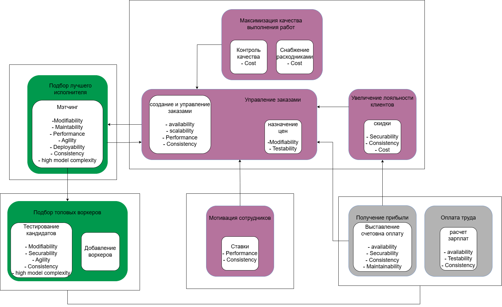

# TOC
1. [Ход работ](#01-ход-работ)
    1. [Cтейкхолдеры](#0101-стейкхолдеры)
    1. [Ограничения](#0102-ограничения)
    1. [Характеристики](#0103-характеристики)
    1. [Архитектура](#0104-архитектура)
    1. [База данных](#0105-база-данных)
    1. [Взаимодействие](#0106-взаимодействие)
    1. [Fitness functions](#0107-fitness-functions)
1. [ADR](#02-adr-по-сути-структуризация-текста-выше) - по сути просто структуризирует остальное, чуть более сжато. Там, где сжимать не хотелось, оставила ссылки на сооветствующие разделы. 

# 01 Ход работ

Цель: 
Определить ЦА системы. Выявить внешние ограничения и понять, чьи инетерсы "важнее" во избежание хаоса.

## 01.01 Стейкхолдеры

Самая важная роль у топ-менеджмента и менеджеров

## 01.02 Ограничения
- [Важно] чтобы определить топ-3% лучших котов, надо сформировать базу. То есть какое-то время должны проводиться тестирования без найма. За это время котьки могут найти другую работу. Критически важно мотивировать топ-3 котиков хотеть работать у нас
- [Важно] правовое регулирование финансовой деятельности. Критически важно
- [Важно] золотую шляпу могут заблокировать в России. Кажется, важно делать достаточный уровень абстракций и не зашивать ее глубоко
- [Важно] мы не берем предоплату за услуги, а значит, есть риск того, что клиент не произведет оплату
- [Переживем] стороннее решение для печенья может прекратить сотрудничество. Но печеньки не так критичны

Выводы: 
- тестирование воркеров отличается от остальных частей системы требованием ttm 
- финансовые операции не должны быть заточены под конкретную систему
- готовые сервисы не рассматриваем

## 01.03 Характеристики

## 01.04 Архитектура

1. Выносим из монолита контекст получения прибыли, так как в нем идет финансовая составляющая. Еще здесь есть интергация с золотой шляпой. Расчет зарплат тоже лучше не делать частью монолита (на этом этапе понимаю, что не надо их класть к заявке). Здесь тоже есть интеграция с золотой шляпой. Так как ограничения схожи, принято решение объединить их в один сервис.
1. Максимизация качества выполнения работ может лежать как в монолите, так и в отдельном сервисе. С точки зрения стоимости это можно класть в монолит. С другой стороны, из-за потенциального развития системы расходников она может быть отделена. При текущих вводных я все же кладу ее в монолит, чтобы уменьшить количество связей.
1. Подбор воркеров (тестирования) - кор фича, которой требуется минимальный релизный цикл. Поэтому он становится отдельным сервисом,
1. Подбор исполнителей - тоже сложная кор фича. Ей логично бы было лежать в монолите для уменьшения числа связей, но из-за сложности и требований к гибкости, выношу отдельно.
1. Мотивация сотрудников должна быть отдельным сервисом потому, что ее надо скрыть от тех, кто ей не должен пользоваться. Ее нельзя класть в монолит, иначе о ней узнают все.
1. Остальное - сильносвязаный монолит, которому проще использовать одну бд вместо синхронизации.

Итоговая схема выглядит так:

Сервис 1 - **ApplicationLifecycle** - Pipline, так как цикл работы с заявкой можно поделить на шаги, "фильтры". В таком ключе весь жизненный цикл заявки от создания будет считаться завершенным на обновлении скидки клиента и обработки отделом качества. Другим вариантом может быть microkernel, где ядро - это crud заявки, отдельный кусок отвечает за изменения статусов с нотификацией, отдельно выделенные на схеме домены (они не меняют заявку, а только делают обновления в системе на ее основе). Но я бы брала pipline, потому что и не работала с ним, и он на первый взгляд отражает то, как заявка гуляет по статусам. 

Сервис 2 - **HR** - Pipline - гибкий сервис из шагов, последовательность которых может со временем меняться

Сервис 3 - **WorkerToAppMatching** Modular монолит или pipline?? По текущему контексту кажется, что это скорее монолит

Сервис 4 - **Motivation** - монолит, layered - в нем нет ничего, что требовало бы усложения системы

Сервис 5 - **Finances** - монолит, скорее layered. Не хочется выделять 2 разных домена внутри него, потому что они выглядят сильно схожими. С точки зрения зависимостей (именно технических) выбираю слои.

Кросивое же, да? Ну пожалуйста...

## 01.05 База данных
| № | Сервис | База | |
| ---- | ---| --- | --- |
| 1 | ApplicationLifecycle | Своя, реляционная | Без особенностей и с фиксированной структурой|
| 2 | WorkerToAppMatching | Графовая, общая с 3 | Внутренний алгоритм скорее ляжет на графы |
| 3 | HR |  Графовая, общая с 2 | Характеристики воркеров скорее всего проще всего показать ребрами графа |
| 4 | Motivation | Своя, любая | Для простоты можно взять документоориентированную |
| 5 | Finances | Своя, изолированная реляционная | Финансоввые операции нужно надежно хрранить от остального |

Таким образом, все сервисы получают свои базы. 

## 01.06 Взаимодействие
| Кто | С кем | Через что | Как |
| ---- | --- | --- | --- |
| 1  ApplicationLifecycle | 2 WorkerToAppMatching | request-responce | синхронно |
| 2 WorkerToAppMatching | 3 HR | Common data | Прекрасно :) |
| 4 Motivation | 1 ApplicationLifecycle | Event driven | Асинхронное оповещение через подписку на события |
| 5 Finances | 1 ApplicationLifecycle | Event driven | Асинхронное оповещение через подписку на события |
| 5 Finances | 3 HR | Event driven | Асинхронное оповещение через подписку на события |

Описание: 
- 1 - ApplicationLifecycle с  2 - WorkerToAppMatching взаимодействуют синхронно. Для создания заявки нужен воркер, до его назначения заявка не подвинется дальше по флоу, и для клиента появится ожидание. В целом можно было бы и асинхронно сделать, но для данного кейса это будет усложнением. Если матчинг начнет выполняться слишком долго для клиента, придется переходить на асинхронку. А пока так.
- 2 WorkerToAppMatching - 3 HR - общие данные, самый простой способ избежать неконсистентных данных, когда на зявку попадает неактивный воркер. Общая база кажется самым простым способом, и в ней будет вся актуальная информация
- 4 Motivation - 1 ApplicationLifecycle - мотивация подписывается на событие изменения статуса заявки и реагирует на него с минимальной задержкой
-  5 Finances - 1 ApplicationLifecycle варианта 2: первый - это крон по расписанию будет запрашивать инфу по защищенной приватной ручке в ApplicationLifecycle. Второй - это подписка финансов на событие изменения статуса заявки. Сейчас беру второй, чтобы не гонять по сетке много важной информации о заявке. Это также закладывает возможность бухгалтерии мониторить финансы в режиме в +- актуальном состоянии, задержка не критична. При этом я бы объявила, что в расчеты субботы попадают только операции, сделанные до пятницы включительно, чтобы не переживать за актуальность данных и упущенные транзакции. Если нам это не ок, придется работать синхронно на request-respponce (батчами, чтобы не пролететь по времени)
- 5 Finances - 3 HR в целом то же, что и в пункте выше. 

 

Антон, потерпи, не так много буков осталось!

## 01.07 Fitness functions

### Общие

- проверка покрытия тестами - 90%
- гит хук для проверки commit message на содержание номера задачи + на запрет прямого пуша в main 
- schema-registry, так как много event-driven коммуникаций
- проверка качества кода через настраиваемый sonar qube (для начала возьмем стандартный список правил)
- проверка форматирования через линтер, запускаемый автоматически перед пушем

### WorkerToAppMatching  и HR
- нагрузочное тестирование

### ApplicationLifecycle
- проверка связности модулей (например, через генерацию схем через rider)
- нагрузочное тестирование

---

# 02 ADR (по сути структуризация текста выше)

Время упаковать то, что писала выше, в adr

## 02.01 - Верхнеуровневая архитектура Happy Cat Box

Status: Proposed 

### Контекст
На основе консернов стейкхолдеров были выявлены требования к системе. Критически важными аспектами являются:
- тестирование воркеров отличается от остальных частей системы требованием ttm - deployability, agality, simplicity, testability
- финансовые операции не должны быть заточены под конкретную систему, обеспечивать consistency и подчиняться законодательству. Availability
- готовые сервисы не рассматриваются без крайней необходимости
- для отбора топ-3% лучших котов надо сформировать базу и замотивировать воркеров выйти в штат - usability
- для тестирований и мэчинга - evolvability, agality, testability, modifiability  за счет алгоритмической сложности. Это конкурентные преимущества
- ставки должны быть максимально изолированы, так как знать о них должны только непосредственно задействованные в процессе котьки

### Decision

 Была выбрана микросервисная архитектура по следующим причинам: 
 - независимый деплой наиболее изменчивых кор доменов - тестирование кандидатов и матчинг
 - релизный цикл матчинга отличается от цикла остальных частей системы
 - консистентность данных (consistency) для расчета зарплат и составления инвойсов
 - высокая сложность двух контекстов: мэтчинга и тестирований кандидатов 
 
 За счет требований к agality, deployability,  testability был выбран микросервисный подход, при этом на 5 сервисов приходится 4 базы данных. 

#### Базы данных
Детализация выбора решений приведена в разделе [База данных](#0105-база-данных). Сводная таблица представлена ниже:

| № | Сервис | База | |
| ---- | ---| --- | --- |
| 1 | ApplicationLifecycle | Своя, реляционная | Без особенностей и с фиксированной структурой|
| 2 | WorkerToAppMatching | Графовая, общая с 3 | Внутренний алгоритм скорее ляжет на графы |
| 3 | HR |  Графовая, общая с 2 | Характеристики воркеров скорее всего проще всего показать ребрами графа |
| 4 | Motivation | Своя, любая | Для простоты можно взять документоориентированную |
| 5 | Finances | Своя, изолированная реляционная | Финансоввые операции нужно надежно хрранить от остального |

#### Сервисное взаимодействие
Детализация выбранных решений и альтернативы представлены в разделе [Взаимодействие](#0106-взаимодействие). Сводная таблица представлена ниже:

| Кто | С кем | Через что | Как |
| ---- | --- | --- | --- |
| 1  ApplicationLifecycle | 2 WorkerToAppMatching | request-responce | синхронно |
| 2 WorkerToAppMatching | 3 HR | Common data | Прекрасно :) |
| 4 Motivation | 1 ApplicationLifecycle | Event driven | Асинхронное оповещение через подписку на события |
| 5 Finances | 1 ApplicationLifecycle | Event driven | Асинхронное оповещение через подписку на события |
| 5 Finances | 3 HR | Event driven | Асинхронное оповещение через подписку на события |

### Проверки
В связи с отсутствием автоматизированных проверок архитектуры
проверка будет выполнена системным архитектором по составленной документации и автоматически генерируемой карте сервисов.

Для поддержки системы в исправном состоянии используем следующее:

- проверка покрытия тестами - 90%
- гит хук для проверки commit message на содержание номера задачи + на запрет прямого пуша в main 
- schema-registry, так как много event-driven коммуникаций
- проверка качества кода через настраиваемый sonar qube (для начала возьмем стандартный список правил)
- проверка форматирования через линтер, запускаемый автоматически перед пушем
- нагрузочное тестирование для WorkerToAppMatching  и HR
- проверка связности модулей (например, через генерацию схем через rider) для ApplicationLifecycle
- нагрузочное тестирование для ApplicationLifecycle

