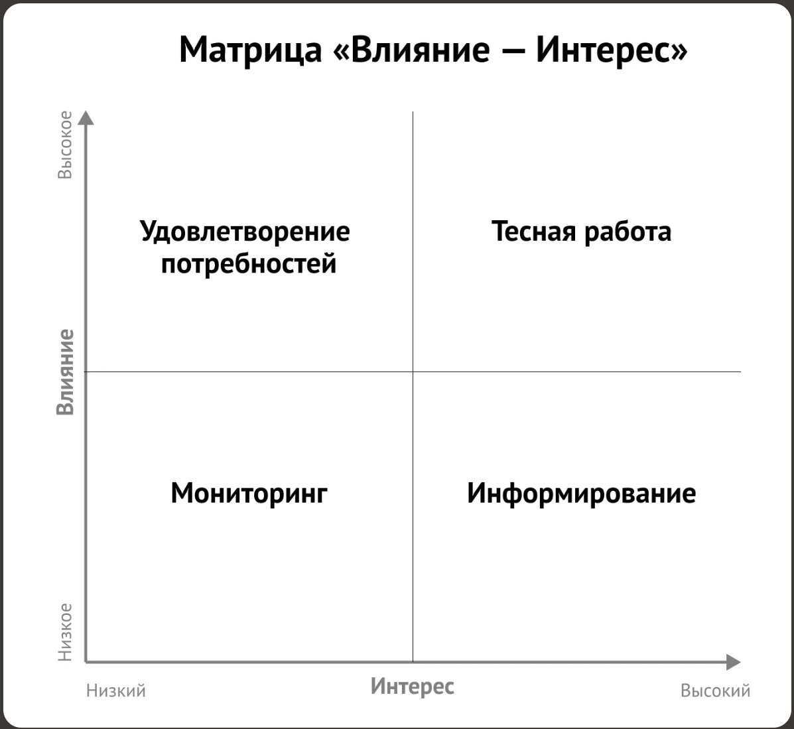

# Внешние ограничения и документация

Определяя ЦА системы, можно собрать полныее требования и вывести внешние ограничения. 

Какие могут быть проблемы, меняющие систему в дальнейшем:
 - хотелки пользователей
 - требования не отражают реальность
 - выбранные виды коммуникаций не работают
 - способ хранения данных и сама бд не удобны
 - структура сервисов не подходит под требования бизнеса
 - разработка все делает по-своему

 Стейкхолдер - это люди, которые заинтересованы в реализации системы.

 Заинтересованность - это цель, ограничени или предрасположенность к определенной архитектуре.

Двигаясь буквой S от тесной работы к мониторингу, стейкхолдеров можно разделить на группы по этой картинке.

 

 Для ее хаполнения можно пользоваться этим списком: 
 помогут четыре критерия оценки качества проделанной работы: informed, committed, authorized и representative. Если прописать их для каждого стекхолдера, то может стать понятнее.

- informed. Имеют ли стейкхолдеры необходимые навыки и опыт, чтобы принимать правильные решения? Если вы работаете над новым проектом банковского скоринга, то вряд ли вам помогут работники кухни;
- committed. Готовы ли стейкхолдеры участвовать в процессе реализации проекта и принимать сложные решения? Если нужен СТО, но он уходит в годовой саббатикал, то придётся искать другого стейкхолдера;
- authorized. Насколько вы уверены, что решения, принимаемые стейкхолдерами, не изменятся в будущем? Например, не поменяются ли решения при увеличении цены этого решения?
- representative. Если стейкхолдер — это группа, то кто представляет всю группу и принимает финальное решение? Например, можно потратить всё время реализации проекта на общение с каждым выпускающим редактором, но, чтобы сэкономить время, достаточно поговорить с главредом.

## Поиск ограничений
- разообраться в домене: найти нерушимые бизнесовые правила
- спросить стейкхолдеров
- оценить силы команды разработки
- оценить, как ведет себя бизнес
- оценить финансы бизнеса
- следить за индутрией (устаревшие законы, типовые проблемы, нарушение законодательства)
- оценка времени

