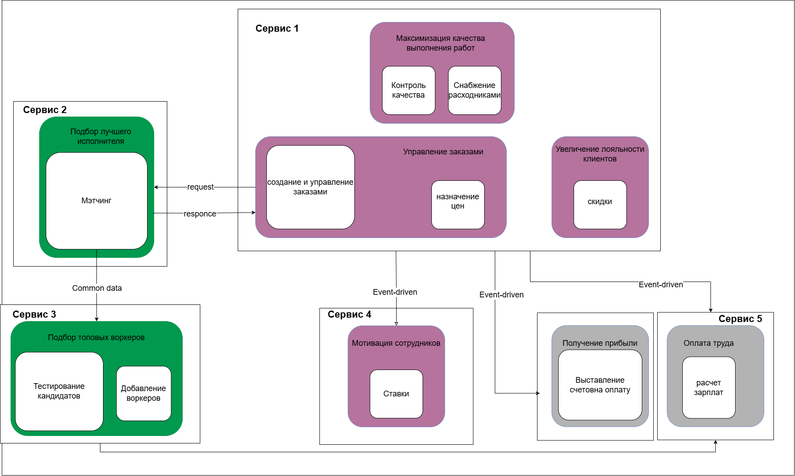

# Система из 0 домашки

для единого отображения перерисовала ее:

и из 3 домашки:

сравнение:

1) Мэтчинг. Самая серьезная проблема. Моэчинг - это кор домен, у которого свои требования к ttm. Плюс логика оказалась довольно сложной. В 0 домашке я не выносила мэтчинг, потому что было написано, что алгоритм еще не придуман, а пока юзается рандом. Не все, что обещает доработать бизнес, реально дорабатывается, поэтому не хотела преждевременно выносить. Далее стало понятно, что алгоритм уже есть, он сложный, будет меняться. Мэтчингу нужно modifability, maintability, agility. Поэтому его необходимо выносить. Так как воркеры лежали отдельно от заявок (у сервиса с тестированиями своя бд) тут добавлялось 

Instability 5 / (5 + 2) = 5/7 

2) Снабжение расходниками. Заносим в монолит (но это если целевая картинка из 3 урока считается единственно верной). А так я б оставила его отдельно, все равно рано или поздно требования к расходникам начнут значительно меняться. Сейчас можно занести в монолит, чтобы каждой заявке для перехода в inProgress не требовалось бы ждать ответа от расходников. Я решаю все же не переносить, не отражаю в плане работ.

Instability 1 / (1 + 1) = 1/2 

3) Контроль качества. Так как это что-то вроде дашборда, изменение данных не предполагается, заносим в монолит и упрощаем коммуникации

Instability 0 / (0 + 1) = 0 

4) Бухгалтерия. Делится на 2 отдельных сервиса: выплаты зп (+ премии) и оплаты клиентов. Они могут далее развиваться в разные стороны. Из одинакового у них может быть какая-то тонкая прослойка-либа для интеграциис золотой шляпой. Избегаю принятия решений на основе текущего момента

Instability 0

## Instability
| сервис | hw 0 | hw 3 |
| --- | --- | --- |
| Монолит (заявки) | 5/8 | 4/5 |
| Мэтчинг | 5/8, монолит | 1/2 |
| Расходники | 1/2  | 4/5, монолит |
| Персонал | 2/3 | 1/2 |
| Выплата зп | 0 | 0 | 
| Списание с клиента | 0 | 0 |
| Ставки | 0 | 0 |
| Контроль качества | 0 | 4/5, монолит|

кор домены стали стабильнее, и ладно. Монолит логично имеет высокое значение, так как он оповещает многие сервисы об изменении своих данных, а они уже делают выводы на его основе.

## Проблемы:
- блокирующий синхронный вызов мэтчинга при создании заявки. Надо менять на асинхронку, тк нет требования к мгновенному переходу заявки от создания в исполнение
- база воркеров отдельно от матчинга => необходима синхронизация без задержек, чтобы заявка не зависла на неактивном воркере
- 

## План работ:

### Когда свободных людей и ресурсов нет, а опыт и (или) инфраструктура есть
меняем сервисы на лету
1) выделяем сабдомен внутри "монолита" - самого большого сервиса, чтобы отделить мэтчинг и все, что касается характеристик воркеров, от заявок. На этом этапе разрываются связи данных.
2) отделяем код мэтчинга в новый сервис, подключая его к расшаренной бд сервиса с воркерами (common data)
3) отлаживаем работу нового сервиса метчинга, сравнивая результаты со старым метчингом
4) отключаем и дропаем старый метчинг
4) подключаем сервис контроля качества к бд сервиса работы с заявками, снимая потребность в синхронизации сервисов
4) переносим его код в монолит
5) отделяем на уровне БД данные воркеров от данных клиентов
6) разделяем бухгалтерию на сервис выплаты зп и сервис работы с клиентами
7) переходим на асинхронную коммуникацию между заявками и матчингом
8) делаем common data между воркерами и мэтчингом, чтобы не париться с синхронизацией

### Когда есть свободные люди и ресурсы, а опыта и (или) инфраструктуры нет
идем от создания дублей сервисов
1) создаем пустой сервис под матчинг
1) подключаем его к бд сервиса с воркерами
1) добавляем механизм асинхронной коммуникации в мэтчинг
1) подключаем сервис по работе с заявками к механизму асинхронной коммуникации (мэтчинг новой версии поднялся)
1) дропаем все остатки старого мэтчинга
1) добавляем 2 новых сервиса - выплаты зп и списания с клиентов
1) добавляем механизм коммуникации с сервисом по работе с заявками и по подбору воркеров
1) мигрируем данные из старой бухгалтерии в бд новых сервисов
1) дропаем старую бухгалтерию
1) добавлем новый сервис контроля качества, который работает с бд сервиса заявок, в сервис заявок
1) дропаем старый сервис контроля качества

