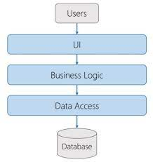
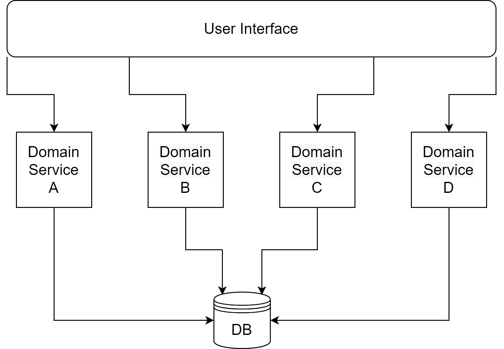
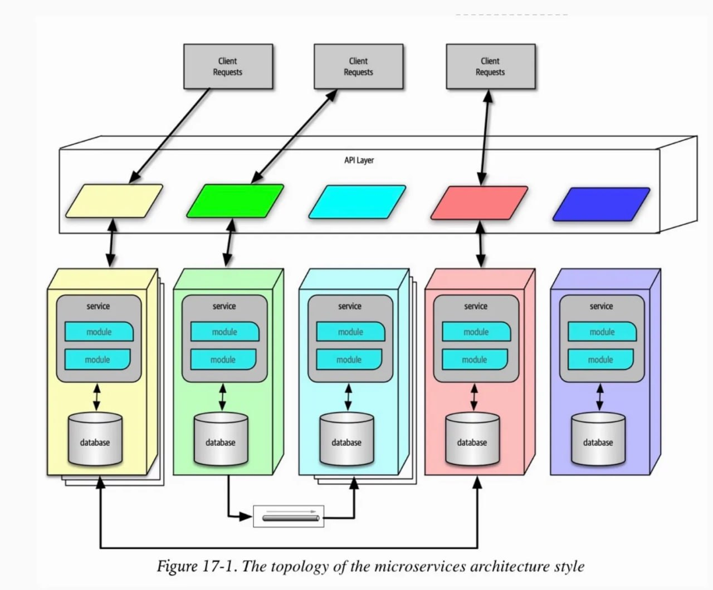
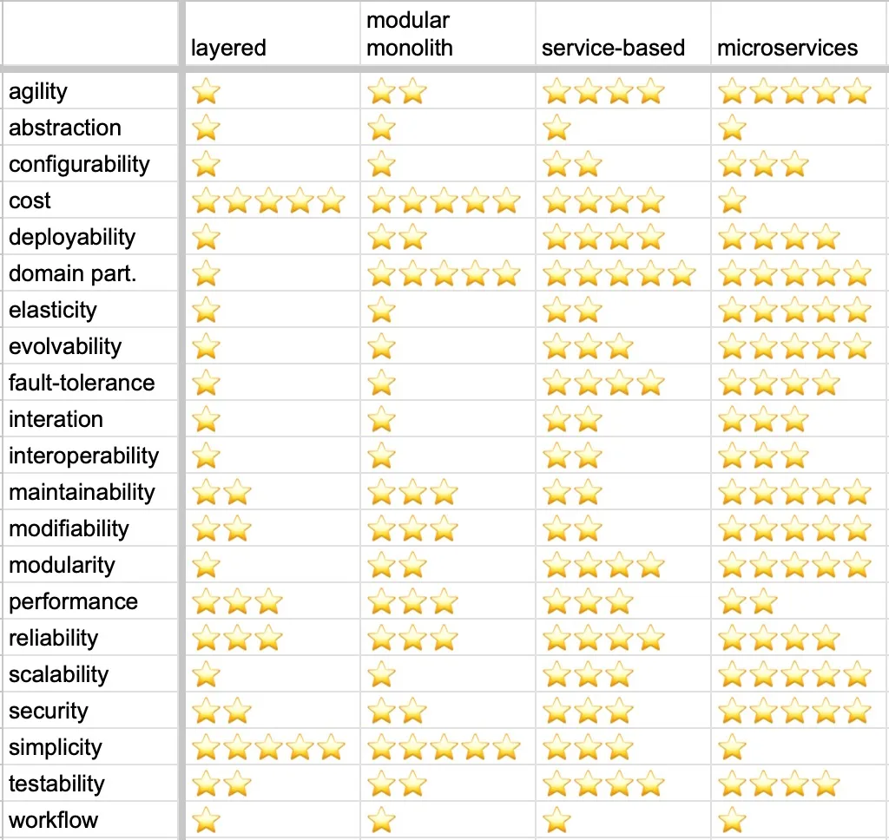

# Архитектурные стили
Описывают, как будут общаться элементы системы.

## Layered acrhitecture (n-layer)
Монолитный стиль. Каждый слой отвечает за свою часть логики - доступ к данным, бизнес-логика и представление данных. Слоев при желании может бытть больше, это дефолт.

Плюсы:
+ простой в имплементации, каждый слой может взаимодействовать только со следующим и предыдущим
+ надежный, так как нет распределнных вызовов, не надо переживать, что какая-то другая часть системы откажет
+ при изменении слоя может понадобиться изменение только слоев ниже (хотя спорно, может, при должном уровне абстракций изменения можно локализовать на одном слое?)
+ нижние слои можно переиспользовать

Минусы:
+ монолит есть монолит - дорогой деплой, сложно тестировать из-за связности, трудно масштабировать
+ нет параллельной обработки
+ нет отказоустойчивости - если упадет, то упадет все
+ возможны пробоемы с перформансом
+ нереально заменить стек
+ чем больше слоев, тем сложнее рефакторинг

--- 
*Где почитать:*
- Глава 10, Fundamentals of Software Architecture Марка Ричардса и Нила Форда
- Статья Марка Ричардса Software Architecture Patterns

---

## Service-based arcitecture 
Гибрид микросервисной архитектуры и n-layer. 
С одной стороны он более гибкий, чем монолит, с другой - менее сложный с точки зрения организации взаимодействия сервисов.
Набор сервисов с общей базой. Это хороший вариант, когда монолит уже не подходит, но распределенная система еще не нужна.

Плюсы:
+ ttm (time to market) из-за изолированного деплоймента
+ высокая устойчивость и доступность из-за распределенного подхода (если хорошо выстроить коммуникацию, конечно)
+ самый простой и дешевый из распределенных стилей
+ сетевой трафик ниже из-за того, что сервисы крупные (да еще и с общей бд)
+ не нужны распределенные транзакции из-за общей бд
+ каждый сервис - bounded context (или агрегат)
Минусы:
- подороже и посложнее монолита, просто потому, что сервисам все равно придется как-то общаться
- scalability (готовность к росту средней нагрузки) средненькая, elasticity (готовность к росту пиковой нагрузки) от этого низкая (а почему?...) TODO

## Microservices architecture
--- 
*Где почитать:*
- Глава 10, Fundamentals of Software Architecture Марка Ричардса и Нила Форда

---
Распределенный стиль, где каждый bounded контекст влияет на сервисы (их размер и функциональность).
Каждый сервис - это либо домен, либо bounded context, либо агрегат, либо вообще команда (которая comand в es, например). У каждого своя база.
Сервисы именно бизнесово независимы, но техническая связь при этом существовать может (это и причина распределенных монолитов). 
У каждого сервиса своя база данных, общаются они через api layer. 

Подходят, если:
- нужна изоляция кода на архитектурном уровне (одному сервису нужен перфоманс, а другому - гибкость)
- нужны 2 противоречащие характеристики в одном сервисе

Плюсы:
+ высокие scalability (готовность к росту средней нагрузки) и elasticity (готовность к росту пиковой нагрузки). Достигается из-за того, каждый сервис скейлится отдельно, можно поднимать разное количество инстансов. Также часть может развиваться, а часть - находиться в стогнации и "не мешать"
+ легко интегрируется с остальными распределенными стилями
  
Минусы:
- дорого и сложно разрабатывать из-за большого количества кросс-вызовов
- за счет того, что приходится отправлять запросы и ждать ответы других микросервисов, вызовы требуют значительного времени на обработку
- приходится думать про кеширование, разделение моделей и другие паттерны

С точки зрения характеристик плюсы:
1. деплойный цикл разный у отдельных микросервисов - deployability
2. масштабирование под любые нагрузки - scalability + elasticity
3. от падения одного сервиса вся система не умрет - availability и fail-tolerance
4. разные технологии в разных микросервисах, смена фреймворка и обновление - все это про modularity
5. уменьшение time-to-market, меньше аффектим другие части

