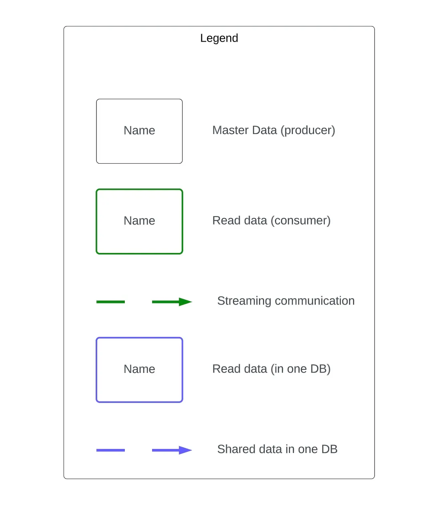

# Моделирование данных

Перспективы моделирования данных:

1. Концептуальная - описание домена. Это классы, которые имеют ценность для домена, и отношения между ними. Она отвечает на 2 вопроса:
   1. какие данные используются в системе
   2. как они связаны между собой
2. Логическая модель данных - TODO
3. Физическая модель данных - TODO

## Как построить концептуальную диаграмму
Это описание структуры системы.
1. Рисуем легенду!
2.  Вытаскиваем **контексты из ES** - пустые квадраты 
3. Внутри каждого квадрата отрисовываем **необходимые данные** (не процессы или что-то еще, а данные, на которых все строится). Если в нескольких контекстах используются одни и те же данные, то дублируем их. Дублирование делает диаграмму понятнее и прозрачнее, чем перемешанные стрелки. Одни и те же данные, но в разных контекстах, можно подсветить одинаковым цветом (проще потом думать, как их хранить).
4. Рисуем **связи между контекстами**. Данные контекста_х зависят от данных контекста_у - рисуем связь между ними: цветом, стрелками. Подобные данные должны быть одного цвета. Стрелки должны показывать связь "овнер -> консюмер",
   ### Рефакторим

5. Если **у двух контекстов условно много связей**, то это повод **пересмотреть контексты**.
6. Если есть **несколько контекстов, из которых формируется рид моделька конкретного события**, надо показать это явно (как хранить - это уже другой вопрос, здесь надо показать, как и откуда эти данные собираются).
7. Если можно убрать данные со схемы, и ничего не изменится - убираем. Лишняя инфа ни к чему
8. Если **у данных** оказывается **несколько овнеров** - просматриваем внимательно, можно ли сделать овнером кого-то одного. Если это невозможно, помним о консистентности данных. Но может, возможно, если пересмотреть контексты в ES?
   
### Шпаргалка

Легенда должна быть всегда. Пример легенды представлен выше. Например, синхронные данные - сплошная стрелка, асинхронные - пунктир, толстая обводка для источника данных, тонская - консюмер (read model) и тд. 

!!!TODO СВОЯ УДОБНАЯ АГЕНДА!!! 

